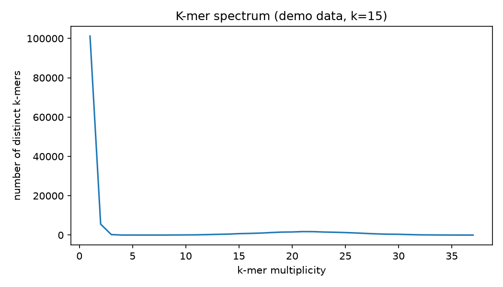

# Kmer Frequency Spectrum

Before you assemble a single contig, the k-mer spectrum already tells you a genome's size, its repeat content, and how error-riddled your reads are — all from counting short substrings.

## Why This Matters

Almost every assembler and many QC tools lean on k-mer counts. The spectrum — how many k-mers occur once, twice, ... N times — has a characteristic shape: a tall spike at low multiplicity from sequencing errors, and a main peak sitting at the true coverage depth. Reading that shape saves you from assembling garbage.

## How It Works

1. Slide a length-k window across every read.
2. Count how often each distinct k-mer appears.
3. Histogram those counts (the spectrum).

## What the Demo Shows



The demo generates reads — with deliberate sequencing errors — from a synthetic genome. The curve shows the low-multiplicity error shoulder and the coverage peak, the very shape tools like GenomeScope fit to estimate genome size and error rate.

## Run It

```bash
pip install -r requirements.txt
python demo.py
```

> Demonstrated on synthetic data, so the whole thing is reproducible with no external downloads.
